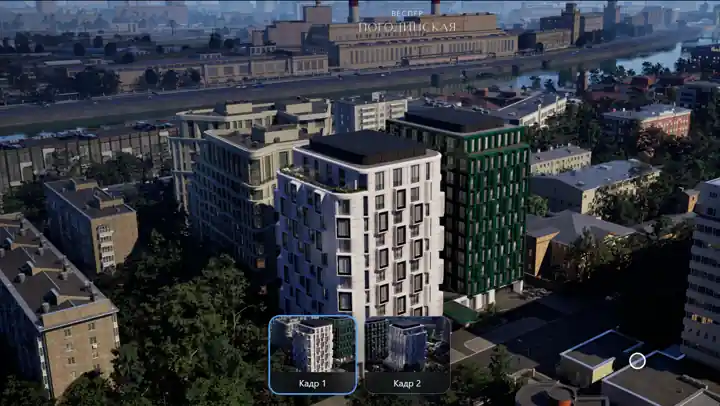
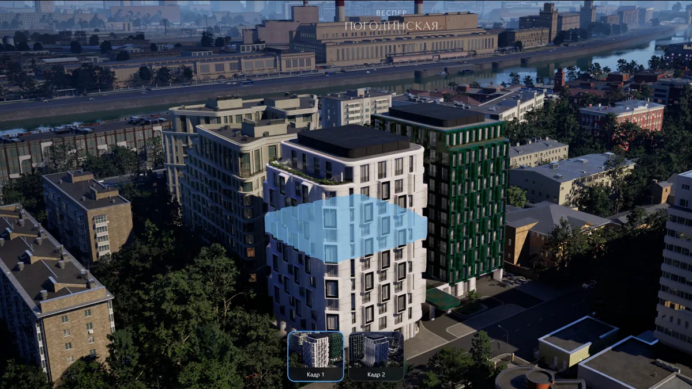
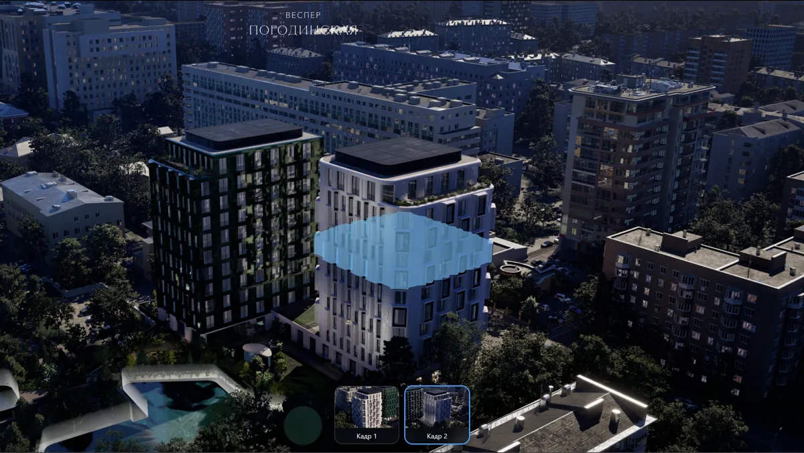
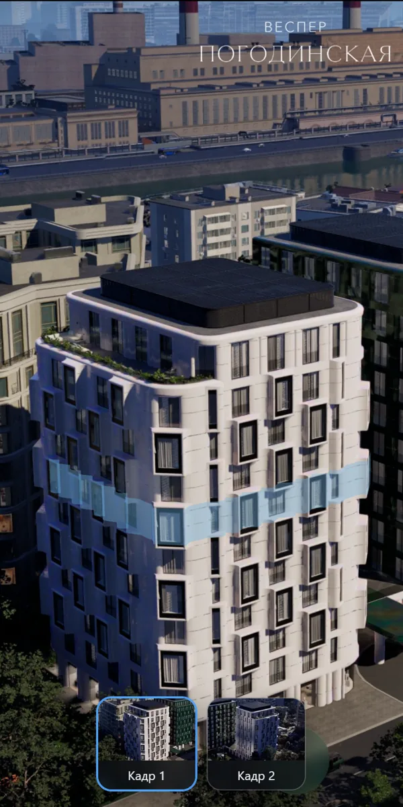
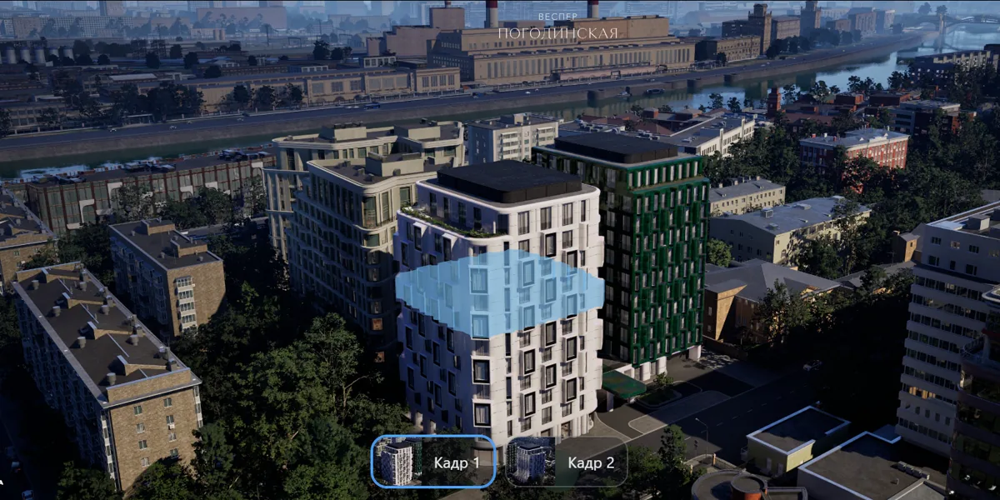

# Выбор квартиры на фасаде

**https://lbdevaa.github.io/facade-floor-highlight/** · `npm i && npm run dev` · `npm run lint`, `npm run typecheck`, `npm test` (55 тестов)

## Как это выглядит

Наведение на фасад подсвечивает этаж: объём из fbx посажен на кадр по камере рендера, а не подрисован
поверх. Нажатие мимо объёма подсветку снимает — на тач-устройстве это единственный способ её убрать.

Кадр меняется — этаж остаётся на том же месте здания: это и есть проверка того, что объём совмещён
по камере, а не подогнан под картинку. Подсветка гаснет вместе со старым видом и загорается снова,
когда указатель возвращается на дом.

<table>
  <tr>
    <td width="50%"></td>
    <td width="50%"></td>
  </tr>
  <tr>
    <td align="center"><b>Кадр 1</b></td>
    <td align="center"><b>Кадр 2: тот же этаж с другой точки съёмки</b></td>
  </tr>
</table>

<table>
  <tr>
    <td width="20%"></td>
    <td width="80%"></td>
  </tr>
  <tr>
    <td align="center"><b>Портрет: кроп ведётся от здания, а не от центра кадра</b></td>
    <td align="center"><b>Альбом: то же окно, другая доля кадра</b></td>
  </tr>
</table>

## Подход

React + TypeScript + three.js через react-three-fiber. Кадр — обычный ``, а не текстура: резче
и не занимает видеопамять; поверх прозрачный канвас с одним мешом из fbx. Камеры лежат
в [`scene.config.json`](public/scene.config.json) как в `Transform_cameras.txt`, единицы — в именах полей;
конфиг читается в рантайме и проверяется: битое поле даёт ошибку с путём, а не `NaN` в матрице камеры.
Приведение координат — в [`shared/lib/ueMath`](src/shared/lib/ueMath/index.ts): перестановка Y↔Z
с определителем −1 меняет хиральность, ориентация берётся из базиса `FRotationMatrix`, а не из `lookAt`, —
иначе кадр с ненулевым Roll развалил бы совмещение. Слои FSD проверяет линтер, решения —
в [`docs/choose.md`](docs/choose.md).

**Расхождение пропорций окна и кадра.** Картинка кропается `object-position`, камера — `setViewOffset`,
обе получают один прямоугольник, разъехаться нечему. Кроп ведётся от проекции объёма, а не от центра кадра:
в портрете от кадра 3439 px остаётся полоса ~640 px, дом в неё не попадал.

## Когда кадров станет сорок

Добавление кадра — запись в JSON: кнопка появится сама, миниатюру сделает `npm run thumbs`. Изменится
вес: кадр в JPEG весит 1.3 МБ, больше, чем весь JS в gzip ([замеры](docs/bundle.md)). Сорок кадров уедут
на CDN, к путям добавится версия — иначе после обновления рендера вернувшийся пользователь увидит старую
картинку из кэша, — грузиться они будут по требованию, соседние на опережение, как сейчас при наведении
на кнопку. Обновление рендера не трогает ни конфиг, ни код: меняются файлы.

**Видеопереход.** Между парами точек съёмки заранее рендерится короткий облёт. При переключении подсветка
гасится, играет ролик, по `ended` показывается статичный кадр цели и включается геометрия: камера нужна только
на статичных кадрах. Для iOS важны `playsinline` и `muted`.

## Как искали положение модели

Трансформ внутри fbx похож на готовый ответ, но верен только по высоте: по нему объём ложится на корпус
**на первом кадре** и уезжает на соседний дом на втором — ошибка легла вдоль луча камеры, а смещение
вдоль луча зрения на кадре не видно. Рабочий способ — две независимые подгонки, по одной на кадр,
и пересечение лучей (`npm run solve`): каждая задаёт направление на объём со своей точки съёмки, две дают
точку. Расхождение лучей — 0.55 м при дистанциях 174 и 187 м. Заодно сошёлся масштаб: подгонки ставили объём
на 175.9 и 189.2 м, пересечение даёт 174.1 и 187.1 — проверка того, что угол обзора взят верно (вертикальный
из высоты матрицы 13.365 мм). Результат: `x −7393.3, y 2847.0, z 16458.3` см, `yaw 12.5°`.
Положение одно на все кадры; что кадр не может его переопределить, проверяется тестом — там же кадр
с чужой камерой и ненулевым Roll.
**Допущения.** Этажи считаются снизу, первый — с колоннами. Модель шире крыши в полтора раза: здание
сужается кверху, на уровне 7 этажа контур совпадает с фасадом.

## AI-агенты

Код и инструменты писал агент, решения и приёмка — мои. Вручную сделано то, что агент не мог: подгонка
объёма на обоих кадрах глазами и проверка на живом телефоне, где нашёлся баг с касанием. Скрипты,
которыми агент смотрел на страницу, — в [`scripts/ai-view`](scripts/ai-view).

**Осознанно не сделано** — вес страницы, отрисовка по требованию и три вопроса к дизайну:
[`docs/next.md`](docs/next.md), с числами и ценой каждого пункта.

## Лицензия

Репозиторий открыт для просмотра, но не является open source. Все права защищены: копировать код,
его фрагменты и материалы, использовать их в своих проектах и создавать производные работы — нельзя
без письменного разрешения. Условия целиком — в [`LICENSE`](LICENSE), запрос на разрешение —
lbdev.aa@gmail.com.
